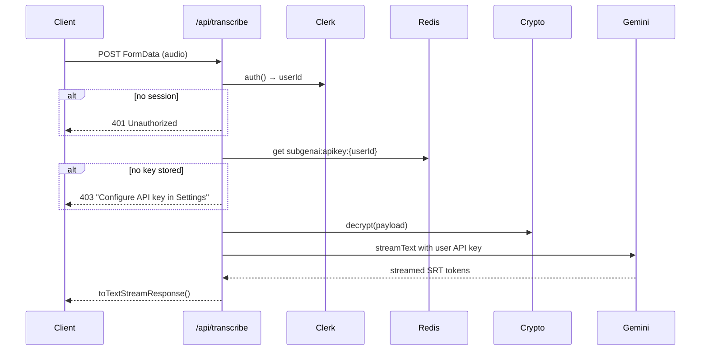
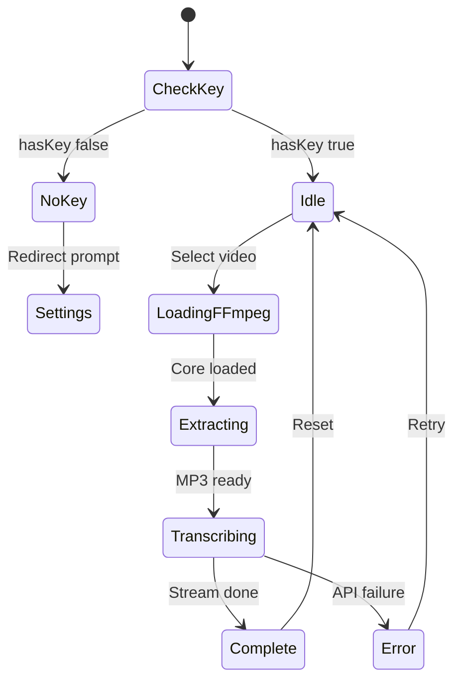

# SubGenAI: Browser-based, AI-Powered Subtitle Generator

**Project:** SubGenAI  
**Description:** SubGenAI is a high-performance, open-source tool that generates accurate, timestamped SRT subtitles from video files. Built for creators who need a fast, privacy-focused workflow, it performs audio extraction entirely in your browser using ffmpeg.wasm before leveraging Google Gemini (Flash 1.5) for high-speed, accurate transcription.

**Auth model:** Bring Your Own Key (BYOK) — users supply their own Gemini API key, encrypted at rest in Upstash Redis. Clerk handles authentication (Google + GitHub social login).

This plan covers architecture only. After approval, the first implementation step will be writing [`PLAN.md`](PLAN.md) at the repo root and executing **Phase 1** (scaffolding + auth boilerplate only).

---

## High-Level Architecture

```mermaid
flowchart TB
  subgraph public [Public Routes]
    Landing["/ — Placeholder + Login/Signup"]
    SignIn["/sign-in"]
    SignUp["/sign-up"]
  end

  subgraph protected [Protected Routes /app/*]
    Tool["/app — Subtitle Generator"]
    Settings["/app/settings — API Key Management"]
  end

  subgraph client [Browser Client]
    Upload[Video Upload]
    FFmpeg[ffmpeg.wasm Extract Audio]
    Compress[MP3 32kbps mono]
    UI[Progress and SRT Preview]
    Download[Download .srt]
  end

  subgraph server [Next.js Server]
    ClerkMW every request
    ClerkMW[Clerk Middleware]
    KeyAPI["/api/settings/api-key"]
    TranscribeAPI["/api/transcribe"]
    Crypto[AES-256 Encrypt/Decrypt]
    Redis[(Upstash Redis)]
    Gemini[Vercel AI SDK + BYOK Gemini Key]
  end

  Landing --> SignIn
  Landing --> SignUp
  ClerkMW --> Tool
  ClerkMW --> Settings
  Upload --> FFmpeg --> Compress
  Compress --> TranscribeAPI
  Settings --> KeyAPI
  KeyAPI --> Crypto --> Redis
  TranscribeAPI --> ClerkAuth
  ClerkAuth --> Redis
  Redis --> Crypto
  Crypto --> Gemini
  Gemini --> UI --> Download
```

**Design principles:**
- Heavy I/O (video decode, audio encode) stays in the browser
- Server never stores video/audio — only ephemeral buffers during transcription
- Server never stores plaintext API keys — AES-256 encrypted in Redis only
- No transcript database — SRT is streamed to client and downloaded locally

---

## Route Map

| Route | Access | Purpose |
|---|---|---|
| `/` | Public | Placeholder landing with Clerk `<SignInButton>` / `<SignUpButton>` |
| `/sign-in/[[...sign-in]]` | Public | Clerk prebuilt SignIn (Google + GitHub) |
| `/sign-up/[[...sign-up]]` | Public | Clerk prebuilt SignUp (Google + GitHub) |
| `/app` | Protected | Main subtitle generator tool |
| `/app/settings` | Protected | User Settings — save/update/remove Gemini API key |
| `/api/settings/api-key` | Protected | GET/PUT/DELETE encrypted key in Redis |
| `/api/transcribe` | Protected | POST audio → streamed SRT (uses user's decrypted key) |

**Middleware:** `clerkMiddleware` + `createRouteMatcher(['/app(.*)', '/api/settings(.*)', '/api/transcribe'])` → `auth.protect()` on match.

---

## Recommended Project Structure

```
sub-gen-ai/
├── app/
│   ├── layout.tsx                      # Root layout + ClerkProvider
│   ├── page.tsx                        # Public placeholder landing
│   ├── globals.css
│   ├── sign-in/[[...sign-in]]/page.tsx # Clerk SignIn
│   ├── sign-up/[[...sign-up]]/page.tsx # Clerk SignUp
│   ├── app/                            # Protected tool area (URL prefix /app)
│   │   ├── layout.tsx                  # Optional: nav shell with UserButton + Settings link
│   │   ├── page.tsx                    # Subtitle generator (dynamic import wrapper)
│   │   └── settings/
│   │       └── page.tsx                # BYOK key management form
│   └── api/
│       ├── settings/
│       │   └── api-key/
│       │       └── route.ts            # GET status, PUT save, DELETE remove
│       └── transcribe/
│           └── route.ts                # POST: audio in → streamed SRT out
├── components/
│   ├── landing-placeholder.tsx         # Simple hero + Clerk auth buttons
│   ├── api-key-form.tsx                # Settings: masked input, save/remove
│   ├── subtitle-generator.tsx          # Client orchestrator (Phase 2+)
│   ├── video-uploader.tsx
│   ├── processing-status.tsx
│   ├── srt-preview.tsx
│   ├── download-srt-button.tsx
│   └── ui/                             # shadcn-style primitives
├── hooks/
│   ├── use-ffmpeg.ts
│   └── use-transcription.ts
├── lib/
│   ├── crypto/
│   │   └── encryption.ts               # AES-256-GCM encrypt/decrypt (Node crypto)
│   ├── redis/
│   │   └── client.ts                   # Upstash Redis singleton (Redis.fromEnv())
│   ├── keys/
│   │   └── user-api-key.ts             # get/set/delete encrypted key by Clerk userId
│   ├── ffmpeg/
│   │   ├── config.ts
│   │   └── extract-audio.ts
│   ├── ai/
│   │   ├── gemini.ts                   # createGeminiModel(apiKey) — per-request BYOK
│   │   └── prompts.ts
│   ├── srt/
│   │   ├── schema.ts
│   │   ├── formatter.ts
│   │   └── validator.ts
│   ├── constants.ts
│   └── utils.ts
├── middleware.ts                       # Clerk middleware — protect /app/* and API routes
├── public/
│   └── ffmpeg/
├── .env.local.example
├── next.config.ts
├── vercel.json
├── tailwind.config.ts
├── tsconfig.json
├── package.json
└── PLAN.md
```

---

## BYOK: Key Management Architecture

### Redis Key Schema

```
Key:   subgenai:apikey:{clerkUserId}
Value: { iv: string, ciphertext: string, tag: string }  // AES-256-GCM components, base64-encoded
TTL:   none (persists until user deletes)
```

### Encryption ([`lib/crypto/encryption.ts`](lib/crypto/encryption.ts))

Use Node.js built-in `crypto` module — **no npm package required**.

```ts
// Algorithm: aes-256-gcm
// Key derivation: SERVER_ENCRYPTION_KEY (32-byte hex or base64) → Buffer
// Output: { iv, ciphertext, authTag } stored as JSON in Redis

import { createCipheriv, createDecipheriv, randomBytes } from 'crypto';

const ALGORITHM = 'aes-256-gcm';
const IV_LENGTH = 12; // 96-bit IV recommended for GCM

export function encrypt(plaintext: string): EncryptedPayload { /* ... */ }
export function decrypt(payload: EncryptedPayload): string { /* ... */ }
```

**Requirements:**
- `SERVER_ENCRYPTION_KEY` must be exactly 32 bytes (256 bits) — generate with `openssl rand -hex 32`
- Never log plaintext keys or decrypted values
- Decrypt only inside server-side Route Handlers and server actions — never in client components

### Key CRUD ([`lib/keys/user-api-key.ts`](lib/keys/user-api-key.ts))

| Function | Behavior |
|---|---|
| `saveUserApiKey(userId, apiKey)` | Encrypt → `redis.set('subgenai:apikey:{userId}', payload)` |
| `getUserApiKey(userId)` | `redis.get` → decrypt → return plaintext (server-only) |
| `hasUserApiKey(userId)` | Check key existence without decrypting |
| `deleteUserApiKey(userId)` | `redis.del('subgenai:apikey:{userId}')` |

### Settings API — [`app/api/settings/api-key/route.ts`](app/api/settings/api-key/route.ts)

```
GET    /api/settings/api-key  → { hasKey: boolean }  (never returns the key)
PUT    /api/settings/api-key  → body: { apiKey: string }  → encrypt + save
DELETE /api/settings/api-key  → remove from Redis
```

All handlers: `const { userId } = await auth()` → 401 if missing.

### Settings UI — [`app/app/settings/page.tsx`](app/app/settings/page.tsx)

- Password-style input for Gemini API key (never pre-fill with existing value)
- "Save Key" / "Update Key" / "Remove Key" buttons
- Status indicator: "API key configured" vs "No key — add one to transcribe"
- Link to [Google AI Studio](https://aistudio.google.com/apikey) for key creation
- Client sends key to server once on save; server encrypts immediately

---

## Authentication (Clerk)

### Setup

1. Install `@clerk/nextjs` via npm; provision via [Vercel Marketplace](https://vercel.com/marketplace/clerk) or Clerk Dashboard
2. Enable **Google** and **GitHub** social providers in Clerk Dashboard → User & Authentication → Social Connections
3. Wrap root layout with `<ClerkProvider>`

### Environment Variables

```env
# Clerk (auto-provisioned via Vercel Marketplace)
NEXT_PUBLIC_CLERK_PUBLISHABLE_KEY=pk_...
CLERK_SECRET_KEY=sk_...
NEXT_PUBLIC_CLERK_SIGN_IN_URL=/sign-in
NEXT_PUBLIC_CLERK_SIGN_UP_URL=/sign-up
NEXT_PUBLIC_CLERK_AFTER_SIGN_IN_URL=/app
NEXT_PUBLIC_CLERK_AFTER_SIGN_UP_URL=/app

# Upstash Redis (auto-provisioned via Vercel Marketplace)
UPSTASH_REDIS_REST_URL=https://...
UPSTASH_REDIS_REST_TOKEN=...

# Server-side encryption (generate manually — NEVER commit)
SERVER_ENCRYPTION_KEY=  # 32-byte hex: openssl rand -hex 32
```

**Removed:** `GOOGLE_GENERATIVE_AI_API_KEY` — replaced by per-user BYOK keys.

### Middleware ([`middleware.ts`](middleware.ts))

```ts
import { clerkMiddleware, createRouteMatcher } from '@clerk/nextjs/server';

const isProtectedRoute = createRouteMatcher([
  '/app(.*)',
  '/api/settings(.*)',
  '/api/transcribe',
]);

export default clerkMiddleware(async (auth, req) => {
  if (isProtectedRoute(req)) {
    await auth.protect();
  }
});

export const config = {
  matcher: [
    '/((?!_next|[^?]*\\.(?:html?|css|js(?!on)|jpe?g|webp|png|gif|svg|ttf|woff2?|ico|csv|docx?|xlsx?|zip|webmanifest)).*)',
    '/(api|trpc)(.*)',
  ],
};
```

### Public Landing ([`app/page.tsx`](app/page.tsx))

Minimal placeholder — no custom marketing page:

```tsx
import { SignInButton, SignUpButton, SignedIn, SignedOut } from '@clerk/nextjs';
import Link from 'next/link';

// Heading: "SubGenAI"
// Subtext: project description
// SignedOut: SignInButton + SignUpButton
// SignedIn: Link to /app
```

---

## Workflow Breakdown

### Phase 1: Project Setup + Auth Boilerplate

**Scope:** Scaffolding and auth only — no ffmpeg, no transcription, no full settings UI.

1. **Scaffold Next.js App Router**
   - `create-next-app` with TypeScript, Tailwind, ESLint, App Router
   - App name: **SubGenAI**

2. **Install Phase 1 dependencies**
   ```bash
   npm install @clerk/nextjs @upstash/redis ai @ai-sdk/google zod clsx tailwind-merge
   npm install -D @types/node
   ```
   Note: `crypto` is Node.js built-in — no install needed.

3. **Configure environment**
   - Create [`.env.local.example`](.env.local.example) with all vars listed above
   - Document key generation: `openssl rand -hex 32`

4. **Clerk integration**
   - [`middleware.ts`](middleware.ts) — protect `/app(.*)`, `/api/settings(.*)`, `/api/transcribe`
   - [`app/layout.tsx`](app/layout.tsx) — `<ClerkProvider>`
   - [`app/sign-in/[[...sign-in]]/page.tsx`](app/sign-in/[[...sign-in]]/page.tsx) — `<SignIn />`
   - [`app/sign-up/[[...sign-up]]/page.tsx`](app/sign-up/[[...sign-up]]/page.tsx) — `<SignUp />`
   - [`app/page.tsx`](app/page.tsx) — placeholder landing with auth buttons
   - [`app/app/page.tsx`](app/app/page.tsx) — protected stub ("Subtitle tool coming soon")
   - [`app/app/layout.tsx`](app/app/layout.tsx) — nav with `<UserButton />` + Settings link

5. **Infrastructure stubs (no business logic yet)**
   - [`lib/redis/client.ts`](lib/redis/client.ts) — `Redis.fromEnv()` singleton
   - [`lib/crypto/encryption.ts`](lib/crypto/encryption.ts) — `encrypt()` / `decrypt()` functions
   - [`lib/keys/user-api-key.ts`](lib/keys/user-api-key.ts) — CRUD wrappers (implemented in Phase 1b)
   - [`app/api/settings/api-key/route.ts`](app/api/settings/api-key/route.ts) — stub returning 501 or basic auth check
   - [`app/api/transcribe/route.ts`](app/api/transcribe/route.ts) — stub with `maxDuration = 60`, auth check only

6. **Configure [`next.config.ts`](next.config.ts)**
   - Metadata (title, description)
   - COOP/COEP headers deferred to Phase 2 (ffmpeg)

7. **Create [`PLAN.md`](PLAN.md)** at repo root mirroring this document

**Phase 1 exit criteria:**
- `npm run dev` starts without errors
- Unauthenticated visit to `/app` redirects to sign-in
- Authenticated user reaches `/app` stub
- Sign-in/up works with Google and GitHub (after Clerk Dashboard config)
- Placeholder landing renders at `/`

---

### Phase 1b: BYOK Key Management (Settings)

**Goal:** Full settings page and API key CRUD before transcription work begins.

1. Implement [`lib/crypto/encryption.ts`](lib/crypto/encryption.ts) — AES-256-GCM
2. Implement [`lib/keys/user-api-key.ts`](lib/keys/user-api-key.ts) — Redis CRUD
3. Implement [`app/api/settings/api-key/route.ts`](app/api/settings/api-key/route.ts) — GET/PUT/DELETE
4. Build [`components/api-key-form.tsx`](components/api-key-form.tsx) + [`app/app/settings/page.tsx`](app/app/settings/page.tsx)
5. Gate `/app` tool UI: show banner if `hasKey === false` with link to settings

---

### Phase 2: Client-Side Audio Extraction (ffmpeg.wasm)

**Goal:** Convert uploaded video to lightweight MP3 at `/app` without sending video to server.

(Unchanged from original plan — see Phase 2 details below.)

#### 2.1 Lazy-load ffmpeg

- `next/dynamic` import [`components/subtitle-generator.tsx`](components/subtitle-generator.tsx) with `{ ssr: false }`
- `useRef(new FFmpeg())` — single instance
- Load core on first file selection

#### 2.2 Audio extraction ([`lib/ffmpeg/extract-audio.ts`](lib/ffmpeg/extract-audio.ts))

```ts
await ffmpeg.exec([
  '-i', 'input', '-vn', '-ac', '1', '-ar', '16000', '-b:a', '32k', '-f', 'mp3', 'output.mp3',
]);
```

#### 2.3 Guardrails

| Constraint | Limit |
|---|---|
| Max video size | 500 MB (warn at 200 MB) |
| Supported formats | `.mp4`, `.webm`, `.mov`, `.mkv` |
| Max audio upload | 15 MB inline |

#### 2.4 COOP/COEP headers (if using `@ffmpeg/core-mt` later)

Add to [`next.config.ts`](next.config.ts) in Phase 2.

---

### Phase 3: Gemini API Integration (BYOK + Vercel AI SDK)

**Goal:** Transcribe audio using the authenticated user's decrypted Gemini key.

#### 3.1 `/api/transcribe` security flow



#### 3.2 BYOK Gemini initialization ([`lib/ai/gemini.ts`](lib/ai/gemini.ts))

```ts
import { createGoogleGenerativeAI } from '@ai-sdk/google';

export function createUserGeminiModel(apiKey: string) {
  const google = createGoogleGenerativeAI({ apiKey });
  return google('gemini-1.5-flash');
}
```

Pass per-request — never use a global env var for the user's key.

#### 3.3 Route handler pseudocode

```ts
export async function POST(req: Request) {
  const { userId } = await auth();
  if (!userId) return Response.json({ error: 'Unauthorized' }, { status: 401 });

  const apiKey = await getUserApiKey(userId);
  if (!apiKey) return Response.json({ error: 'No API key configured' }, { status: 403 });

  const formData = await req.formData();
  const audioBuffer = await (formData.get('audio') as File).arrayBuffer();

  const model = createUserGeminiModel(apiKey);
  const result = streamText({
    model,
    system: SRT_SYSTEM_PROMPT,
    messages: [{ role: 'user', content: [
      { type: 'text', text: 'Transcribe into valid SRT...' },
      { type: 'file', data: audioBuffer, mediaType: 'audio/mpeg' },
    ]}],
  });

  return result.toTextStreamResponse();
}
```

#### 3.4 SRT output

- **MVP:** Prompt for raw SRT text; validate with [`lib/srt/validator.ts`](lib/srt/validator.ts)
- **Enhancement:** `Output.object({ schema })` for structured cues

**No transcript persistence** — stream directly to client; user downloads `.srt` locally.

---

### Phase 4: UI/UX

**Goal:** Polished single-page workflow at `/app`.

#### 4.1 State machine



#### 4.2 Components

| Component | Purpose |
|---|---|
| [`video-uploader.tsx`](components/video-uploader.tsx) | Drag-drop, validation |
| [`processing-status.tsx`](components/processing-status.tsx) | Stepper + progress |
| [`srt-preview.tsx`](components/srt-preview.tsx) | Live streamed SRT |
| [`download-srt-button.tsx`](components/download-srt-button.tsx) | Local `.srt` download |
| [`api-key-form.tsx`](components/api-key-form.tsx) | Settings key management |

#### 4.3 Post-MVP polish

- Dark/light mode, privacy callout, copy-to-clipboard
- Custom landing page (explicitly out of scope for now)

---

## Technical Constraints

### Vercel Serverless Timeout

| Strategy | Purpose |
|---|---|
| **Stream response** | `streamText` + `toTextStreamResponse()` keeps connection alive |
| **`maxDuration = 60`** | On transcribe route; increase if plan allows |
| **Small audio payload** | 32 kbps mono reduces processing time |
| **Duration warnings** | UI warns for clips >15–20 min |
| **Chunking fallback** | Split long audio client-side; merge SRT |

Use **Node.js runtime** (not Edge) for Gemini SDK and crypto.

### ffmpeg.wasm Performance

| Topic | Recommendation |
|---|---|
| Threading | MVP: `@ffmpeg/core` single-thread |
| Init | Lazy load; cache in `useRef` |
| WASM size | ~31 MB; show loading UI |
| Turbopack | Disable if worker fails in dev |
| File cap | Reject >500 MB before processing |

### Payload Limits

- Vercel body: 4.5 MB (Hobby) — aggressive compression essential
- Gemini inline: ~20 MB total request
- No server-side media persistence

---

## Dependencies

### Production (Phase 1)

| Package | Purpose |
|---|---|
| `next`, `react`, `react-dom` | Framework |
| `typescript`, `tailwindcss` | Types + styling |
| `@clerk/nextjs` | Authentication (Google, GitHub) |
| `@upstash/redis` | Encrypted API key storage |
| `ai`, `@ai-sdk/google` | Vercel AI SDK + Gemini (Phase 3) |
| `zod` | Validation |
| `clsx`, `tailwind-merge` | CSS utilities |

### Deferred to Phase 2

| Package | Purpose |
|---|---|
| `@ffmpeg/ffmpeg`, `@ffmpeg/util` | Client-side audio extraction |

### Built-in (no install)

| Module | Purpose |
|---|---|
| `node:crypto` | AES-256-GCM encryption |

---

## Security Summary

| Concern | Mitigation |
|---|---|
| API key at rest | AES-256-GCM encrypted in Upstash Redis |
| API key in transit | HTTPS only; key sent once on save, never returned |
| API key on client | Never stored in localStorage; never in API responses |
| Encryption key | `SERVER_ENCRYPTION_KEY` server-only env var; rotate with re-encryption plan |
| Route access | Clerk middleware + `auth.protect()` on `/app/*` and APIs |
| Transcribe route | Verify session → fetch encrypted key → decrypt server-side → use once per request |
| User media | Browser-only video processing; ephemeral audio buffer on server |
| Transcripts | Not stored — streamed to client only |
| Error messages | Generic to client; details logged server-side only |
| Input validation | Whitelist audio MIME types; cap upload size |

### Key rotation

If `SERVER_ENCRYPTION_KEY` is compromised, generate a new key and run a one-time migration script to re-encrypt all Redis entries (future ops task — document in README).

---

## Implementation Order

1. **Phase 1** — Scaffold, Clerk auth, middleware, placeholder landing, env + lib stubs
2. **Phase 1b** — Encryption, Redis CRUD, settings API + page
3. **Phase 2** — ffmpeg.wasm audio extraction at `/app`
4. **Phase 3** — BYOK transcribe API + streaming SRT
5. **Phase 4** — Full UI polish, download, error states

---

## Risks and Mitigations

| Risk | Mitigation |
|---|---|
| User has no API key | Gate tool UI; prompt to visit `/app/settings` |
| Invalid Gemini key saved | Validate format on save; test with lightweight ping in Phase 1b (optional) |
| Encryption key lost | Document backup; keys become unrecoverable without it |
| ffmpeg.wasm slow on mobile | Size limits + time estimates |
| Gemini returns markdown SRT | Strip fences in validator |
| Timeout on long clips | Streaming + chunking |
| Turbopack breaks workers | Webpack fallback |

---

## Deliverables After Approval

1. Create [`PLAN.md`](PLAN.md) at repo root
2. Execute **Phase 1 only** — scaffold + auth boilerplate
3. **Pause for review** before Phase 1b / Phase 2
